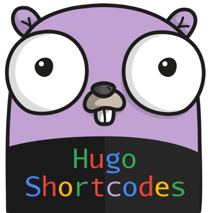

	

		
		 
	

# Awesome Hugo Shortcodes 

A curated list of awesome Hugo shortcodes

- [Raw HTML](shortcodes/rawhtml) - raw html
- [React app](shortcodes/reactblock) - use react app at any Hugo post
- [Instagram](shortcodes/instagram) - instagram post
- [Tweet](shortcodes/tweet) - twitter post
- [Table of Contents](shortcodes/toc) - creates a table of content of the current post
- [Wikipedia link](shortcodes/wikilink) - Wikipedia link genertor
- [Image](shortcodes/img) - insert resizable image in post
- [Chart.js](shortcodes/chart) - display [Chart.js](https://www.chartjs.org/) diagrams/blocks
- [hugo-quiz](https://github.com/bonartm/hugo-quiz) - write quizzes with a markdown-like syntax

# Reference

- https://gohugo.io/content-management/shortcodes/
